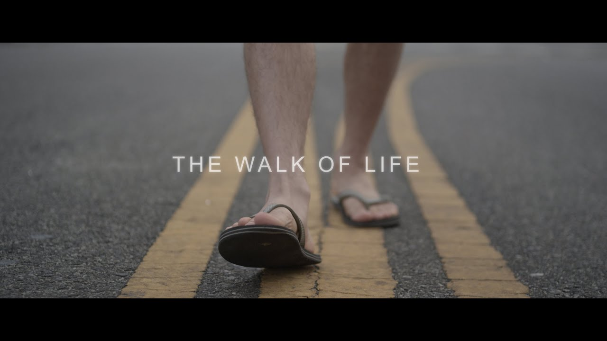

# Project "WOL"

## :question: Description

"WOL" means Walks Of my Life is some kind of diary. The most vital importamt steps in my life I'm going to do or I've ever come across. The Story of my life and my plans for future I wish came true. 

## :bust_in_silhouette: Personal traits I need to obtain and work with for reaching all the aims and develip success

- Resilience and persistence

- Honesty

- Strategic creativity

- Willingness to learn

- Outgoingness

- Never give up

## :rocket: Aims and achivements

- Graduate from Uni

- Start your career

- Giving a birth

- Manage to get remote job and stay any place

- Change you occupation

- Enjoy your life and activities

- Chorn out as many commits as you capable of

#### Last but not least

Come on, man, you can do everything you wish. This Readme is just the first step!